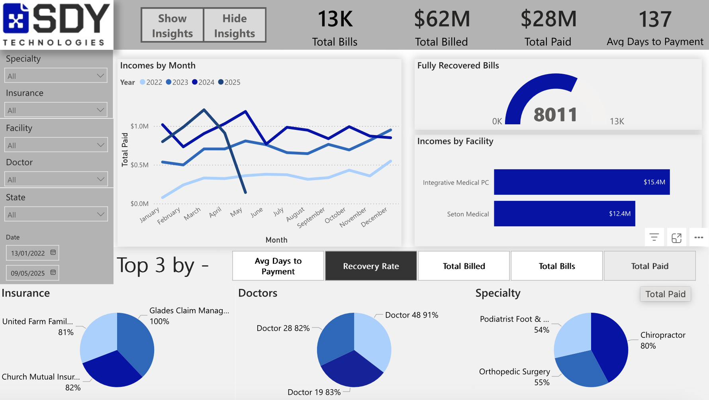
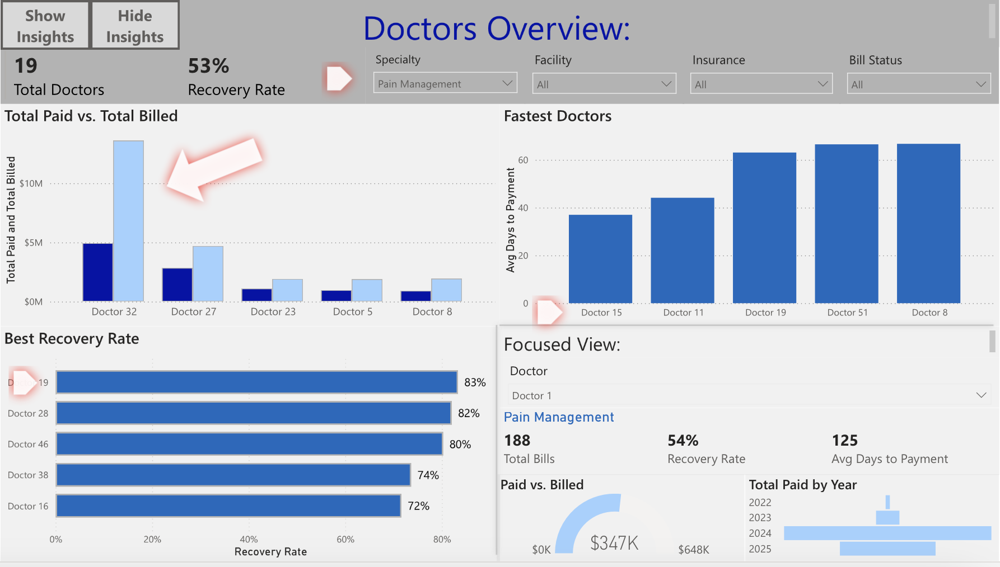
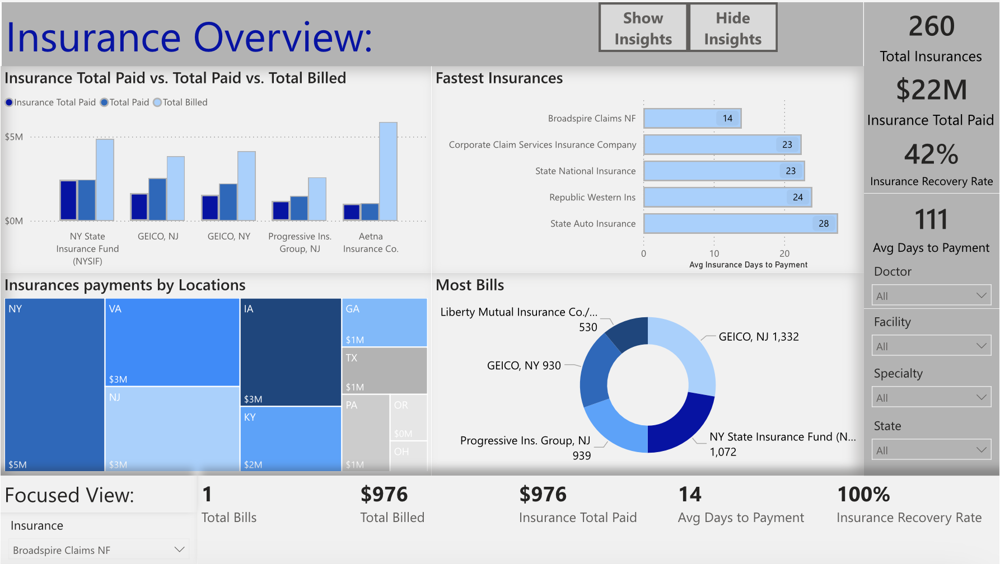

# Medical Billing Analytics Dashboard – Internship Project

This Power BI dashboard was built during my internship at SDY Technologies, as part of a real-world project in the healthcare billing domain.

## 🔍 Overview
The dashboard analyzes billing performance across doctors, medical specialties, and insurance companies. It helps identify trends in revenue, payment speed, and recovery efficiency.

All data has been fully anonymized. Doctor names and patient-related information were replaced with placeholder values.

## 📊 Features
- Multi-page dashboard with interactive slicers and clean layout
- KPIs for total billed, total paid, recovery rates, and days to payment
- Filters by doctor, insurance, specialty, and location
- Dynamic “Top 3” selector for viewing top doctors, insurance companies, and specialties by chosen metric
- “Show Insights” button that highlights key trends and observations visually
- Advanced DAX measures and conditional visual logic
- Focused view panels for selected doctors or insurers, with contextual KPIs

## 🛠️ Tools Used
- Power BI
- SQL (MySQL/DBeaver)
- Data cleaning, transformation, and visualization techniques

## 🖼️ Preview
# Main Dashboard

### Doctors View

### Insurance View

## 📁 Files
- `internship_dashboard.pbix`- the Power BI file
- `Script-1.sql`- the SQL query used to build the dataset

